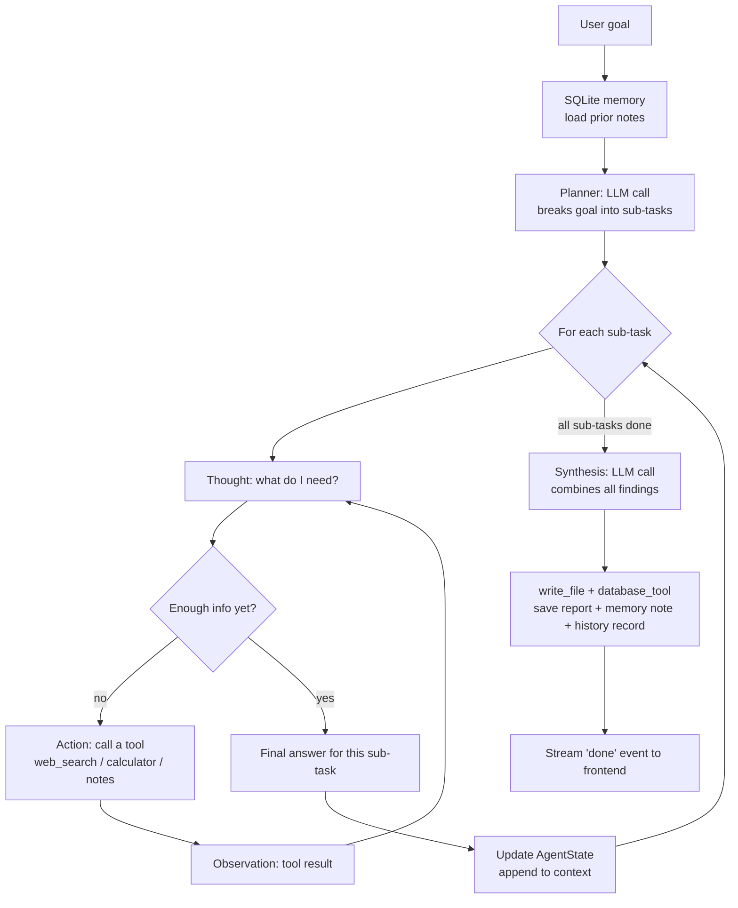

# AI Research Agent — Full-Stack Agentic System

A submission for the *"Design and build an AI Agentic System"* contest.
React frontend + FastAPI backend, structured as separate services rather
than one script, so each part of the required agentic workflow is its own
module the evaluator can point at.

## 1. Problem / Task Chosen

**Research Agent**: given a topic (free-text goal typed into the dashboard),
the agent autonomously plans a set of sub-tasks, reasons about each one
using the ReAct pattern (Thought → Action → Observation), decides which
tools to call, keeps state across every step, and finally synthesizes
everything into one Markdown report — with zero human intervention between
submitting the goal and receiving the report. The frontend shows every one
of those steps executing live.

| Contest requirement | Where it lives |
|---|---|
| Text-based user input | `frontend/src/components/TaskInput.jsx` |
| Break task into steps (planning) | `backend/app/agent/planner.py` |
| LLM reasoning per step | `backend/app/agent/reasoning.py` (ReAct prompts) |
| Tool use / execution | `backend/app/tools/*.py` + `backend/app/agent/executor.py` |
| State/context across steps | `backend/app/agent/state.py` |
| Gets better with use | `ResearchAgent.run()` loads prior SQLite notes into the planning/execution context and saves a compact memory note after each report |
| Conditional behaviour | Built into the ReAct loop — the model itself decides each turn whether it has enough information or needs another tool call (see §4) |
| Final coherent output | `Reasoning.synthesize()`, streamed to the frontend + saved via `report_service.py` |
| Full-stack | React (Vite) frontend + FastAPI backend |
| Structured code, not one file | See project layout below |
| Presentation support | `PRESENTATION.md` + `DEMO_SCRIPT.md` |

## 2. Architecture & Workflow

```text
                USER
                  │
                  ▼
        ┌──────────────────┐
        │  React Frontend   │   TaskInput → live AgentSteps/ToolExecution → ReportViewer
        └────────┬─────────┘
                  │ goal (over WebSocket)
                  ▼
        ┌──────────────────┐
        │  FastAPI Backend  │   /ws/research streams every event live
        └────────┬─────────┘
                  ▼
        ┌─────────────────────────┐
        │   Agent Controller       │   agent.py
        │                          │
        │  1. Memory → prior notes │
        │  2. Planner → sub-tasks  │
        │  3. Executor → ReAct loop│
        │     per sub-task         │
        │  4. State → context      │
        │     carried forward      │
        │  5. Reasoning → synthesis│
        └───────┬──────────────────┘
                │
      ┌─────────┼──────────┬───────────┐
      ▼         ▼          ▼           ▼
  web_search  calculator  file I/O   database
   (search)              (report)   (notes + history)
```



### Project layout

```text
ai-research-agent/
├── frontend/
│   ├── src/
│   │   ├── components/
│   │   │   ├── TaskInput.jsx        # goal input
│   │   │   ├── AgentPlan.jsx        # shows the plan
│   │   │   ├── AgentSteps.jsx       # live ✓ / ● / ○ execution checklist
│   │   │   ├── ToolExecution.jsx    # tool call / observation log
│   │   │   ├── Sources.jsx          # web_search results consulted
│   │   │   └── ReportViewer.jsx     # final Markdown report
│   │   ├── pages/Dashboard.jsx      # wires everything to the WebSocket
│   │   ├── services/api.js          # WebSocket + REST client
│   │   └── App.jsx
│   └── package.json
│
├── backend/
│   ├── app/
│   │   ├── main.py                  # FastAPI routes + WebSocket
│   │   ├── agent/
│   │   │   ├── agent.py             # orchestrator (Plan→Act→Observe→Respond)
│   │   │   ├── planner.py           # goal -> sub-task list
│   │   │   ├── executor.py          # ReAct loop for one sub-task
│   │   │   ├── reasoning.py         # all prompts + raw LLM calls
│   │   │   └── state.py             # AgentState carried across steps
│   │   ├── tools/
│   │   │   ├── search_tool.py       # web_search (DuckDuckGo, no key needed)
│   │   │   ├── calculator_tool.py   # safe arithmetic
│   │   │   ├── file_tool.py         # read_file / write_file
│   │   │   └── database_tool.py     # SQLite: agent notes + report history
│   │   ├── llm/client.py            # Groq (free, default) / Anthropic (optional) / mock
│   │   ├── models/schemas.py        # Pydantic request/response models
│   │   └── services/report_service.py
│   ├── tests/
│   │   ├── test_agent.py            # full run, LLM mocked
│   │   ├── test_llm_client.py       # mock and real-mode setup behavior
│   │   ├── test_tools.py            # calculator unit tests
│   │   └── test_api.py              # FastAPI TestClient, LLM mocked
│   └── requirements.txt
│
└── README.md
```

## 3. Setup & Run Instructions

**Backend:**
```bash
cd backend
pip install -r requirements.txt
cp .env.example .env
uvicorn app.main:app --reload --port 8000
```

**LLM provider — free by default.** This project uses **Groq's free tier**
(`LLM_PROVIDER=groq`, no credit card), which runs open-weight models
(`openai/gpt-oss-120b` by default) with real tool-calling support:
1. Create a free key at [console.groq.com](https://console.groq.com)
2. Put it in `backend/.env` as `GROQ_API_KEY=...`
3. Set `MOCK_LLM=false`

No paid API is used anywhere in this project by default. `LLM_PROVIDER=anthropic`
is left in as an optional alternate path (needs your own `ANTHROPIC_API_KEY`)
but is not required and is not what the default setup uses.

For a fully offline classroom demo with no API key at all, set `MOCK_LLM=true`
in `backend/.env`. That mode uses a deterministic local LLM substitute, so the
same workflow can be shown with zero cost and zero network dependency. The
search tool will honestly report if it can't reach a live search backend
rather than fabricating results. For final judging, run once with
`MOCK_LLM=false` and a real Groq key, and include that live output in your video.

**Frontend** (separate terminal):
```bash
cd frontend
npm install
cp .env.example .env          # defaults already point at localhost:8000
npm run dev
```
Open the printed Vite URL (usually `http://localhost:5173`), type a research
topic, and click **Start Research** — the plan, live tool calls, and final
report will stream in as the agent works.

**Running tests** (no API key needed — the LLM is mocked):
```bash
cd backend
pytest
```

On Windows machines where the system temp folder is locked down, run:
```bash
pytest --basetemp ../.pytest_tmp
```

**Testing the backend alone, without the frontend:**
```bash
curl -X POST http://localhost:8000/api/research \
  -H "Content-Type: application/json" \
  -d '{"goal": "Applications of computer vision in agriculture"}'
```

## 4. Sample Input / Output

**Input goal (typed into the dashboard):**
> "Research the pros and cons of remote work for software teams and give a recommendation."

**What streams into the dashboard, in order:**
```
Memory:
  🔧 get_notes({'topic': 'Research the pros and cons of remote work for software teams and give a recommendation.'})
  ↳ No notes found... (or prior notes from an earlier run)

Plan (4 steps):
  1. Search for documented benefits of remote work for software teams
  2. Search for documented drawbacks/challenges of remote work for software teams
  3. Compare findings and identify which factors matter most for software specifically
  4. Formulate a balanced recommendation

Step 1 ▶ Search for documented benefits...
   🔧 web_search({'query': 'benefits of remote work software teams'})
   ↳ 1. Study: remote workers report fewer interruptions...
   ✓ Key benefits: fewer interruptions for deep work, wider hiring pool...

Step 2 ▶ Search for documented drawbacks...
   🔧 web_search({'query': 'challenges of remote work software teams'})
   ↳ 1. Report: onboarding juniors is harder remotely...
   ✓ Main drawbacks: harder onboarding, slower async decisions...

Step 3 ▶ Compare findings...
   ✓ For software specifically, deep-work benefits tend to outweigh...

Step 4 ▶ Formulate a balanced recommendation
   ✓ Recommendation: hybrid default, fully remote for senior ICs...

Memory saved:
  🔧 save_note({'topic': 'Research the pros and cons of remote work for software teams and give a recommendation.'})
  ↳ Saved note under topic ...
```

**Final `research_report.md` written to `backend/data/reports/` (abridged):**
```markdown
# Remote Work for Software Teams: Findings & Recommendation

## Benefits
- Fewer interruptions, more sustained deep-work time
- Wider hiring pool, less relocation friction

## Drawbacks
- Harder onboarding for junior engineers
- Async communication can slow fast-moving decisions

## Recommendation
A hybrid default (2-3 in-person days) captures most collaboration
benefits while preserving deep-work time, with full remote as an
option for senior individual contributors.
```

*(This trace is illustrative of the format the agent produces — it's not
from a live run, since I can't call the Anthropic API from this sandbox.
Run it once yourself and swap in the real output before you submit.)*

## 5. Where "agentic behaviour" actually shows up

When the teacher asks *"where is the agentic behaviour, this could just be
a chatbot"* — this is the answer:

- **The LLM never sees the user's goal and writes the report directly.**
  It first produces a plan (`planner.py`), then for every sub-task it goes
  through a Thought → Action → Observation loop (`executor.py`) where **it
  decides, itself, each turn** whether to call a tool or whether it already
  has enough information — that decision is the conditional/autonomous part,
  and it happens inside the model's own reasoning, not in an `if` statement
  written by us.
- **State persists across the whole run.** `AgentState.context_so_far()`
  is what step 3 actually reads to build on what step 1 found — remove it
  and each step would reason in isolation.
- **The agent can improve across runs.** At the start of a run,
  `agent.py` calls `get_notes` to load relevant SQLite memory into the
  planning and execution context; after the final report, it calls
  `save_note` so future runs on the same goal start with prior context.
- **Tool use is real, not simulated.** `web_search` hits DuckDuckGo live,
  `calculator` really evaluates expressions, and `save_note`/`get_notes`
  read and write actual SQLite rows.
- **The final report is only produced once every sub-task has an answer**
  — synthesis is a separate LLM call over the accumulated findings, not
  the first response the model gave.

## 6. Notes on Design Choices

- **Why FastAPI + WebSocket instead of one blocking REST call**: a plain
  request/response would only show the final report, hiding all the agentic
  behaviour the contest wants demonstrated. Streaming events lets the
  dashboard show the plan forming and each tool call happening live, which
  makes the demo video far more convincing.
- **Why split `planner` / `executor` / `reasoning` / `state`** instead of
  one `agent.py`: `reasoning.py` owns every prompt and LLM call;
  `planner.py` and `executor.py` are thin callers of it; `agent.py` only
  orchestrates the three plus `state.py`. Each file can be explained and
  tested in isolation.
- **Why a dispatch-table for tools** (`tools/__init__.py`): adding a new
  capability is one function in its own module plus one schema entry — no
  changes needed anywhere in the orchestration code.
- **Why SQLite over a heavier DB**: zero setup, still gives a real
  Database Tool and a persistent report history for the `/api/reports`
  endpoints, without needing Postgres/Docker for a class demo.
